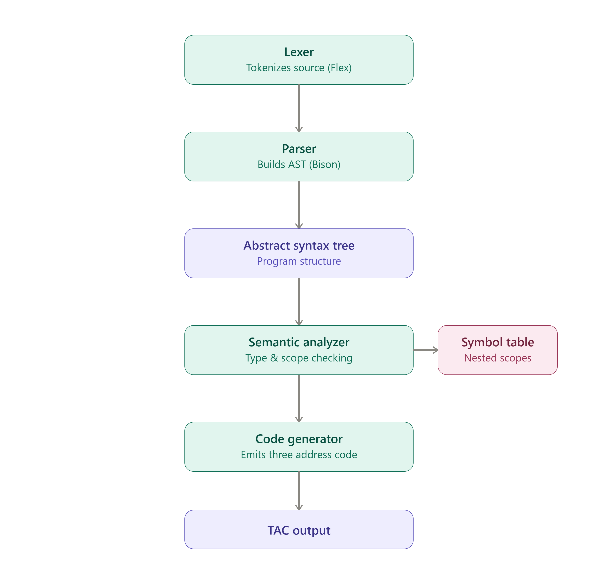
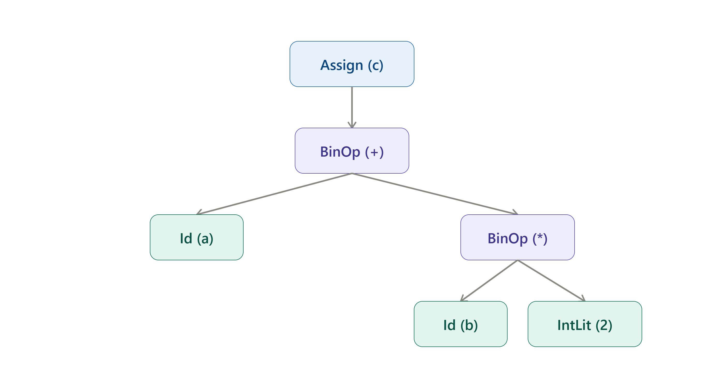
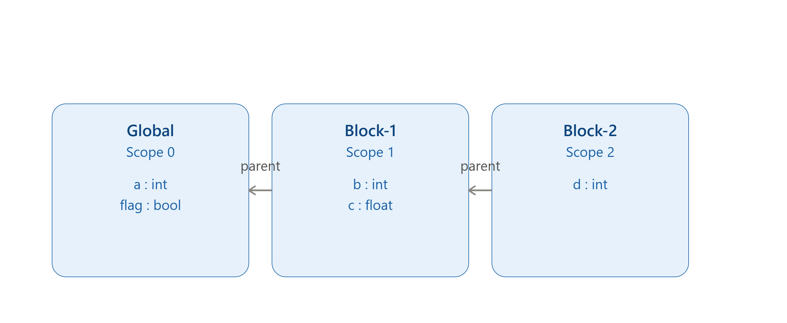
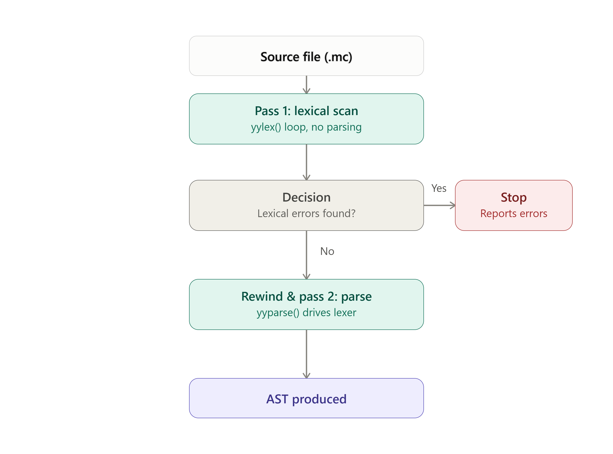

# Compiler Architecture

## Pipeline Overview



```
Source Code (.mc)
      |
      v
+--------------------+
|  Lexical Analyzer  | (Flex)  -->  Token Stream
+--------------------+
      |
      v
+--------------------+
|  Syntax Analyzer   | (Bison) -->  Abstract Syntax Tree (AST)
+--------------------+
      |
      v
+--------------------+
| Semantic Analyzer  | (Symbol Table + Type Checking) --> Validated AST
+--------------------+
      |
      v
+--------------------+
| Intermediate Code  | (TAC Generator)
|    Generation      |
+--------------------+
      |
      v
Three Address Code (TAC) Output
```

## Module Responsibilities

| Module | Directory | Responsibility |
|---|---|---|
| Lexer | `src/lexer/` | Converts raw source text into tokens. Discards whitespace/comments. Reports invalid characters. |
| Parser | `src/parser/` | Consumes tokens, validates against CFG, builds AST. Reports syntax errors, recovers using `error` token. |
| AST | `src/ast/` | Node structure for every language construct. Provides text-based tree printer. |
| Symbol Table | `src/symbol_table/` | Tracks declared identifiers via scope-chain (parent-pointer linked list). Supports nested scoping. |
| Semantic Analyzer | `src/semantic/` | Walks AST, checks undeclared variables, redeclaration, scope violations, type mismatches, invalid assignments/expressions. |
| Code Generator | `src/codegen/` | Walks validated AST, emits Three Address Code, handles control flow via labels/jumps. |
| Driver | `src/main.c` | Orchestrates pipeline; supports `--phase=` flag for selective output. |

## AST Example

The diagram below shows how the expression `c = a + b * 2;` is represented as a tree. Note that `*` sits deeper in the tree than `+`, meaning operator precedence has already been resolved by the parser at this stage — the code generator does not need to re-derive it.



## Data Flow Between Phases

1. Lexer -> Parser: token stream via on-demand `yylex()` calls.
2. Parser -> Semantic Analyzer: fully-built `ASTNode*` tree (`ast_root`).
3. Semantic Analyzer <-> Symbol Table: `scope_enter()`/`scope_exit()` on Block nodes, `scope_declare()`/`scope_lookup()` on declarations/uses.
4. Semantic Analyzer -> Code Generator: same AST, annotated with `eval_type`.

## Symbol Table Scope Chain

Each block introduces a new scope frame, linked to its enclosing scope via a parent pointer. `scope_lookup()` searches the current frame first, then walks outward through parents until it finds a match or reaches the global scope.



## Two-Pass Compilation

- Pass 1 (Lexical-only): `while (yylex() != 0)` loop scans the whole file for lexical errors.
- Pass 2 (Parsing): `rewind(yyin)`, then `yyparse()` drives the lexer again on-demand.

This gives Lexical Analysis a distinct, independently-reportable status matching the manual's pipeline diagram.


